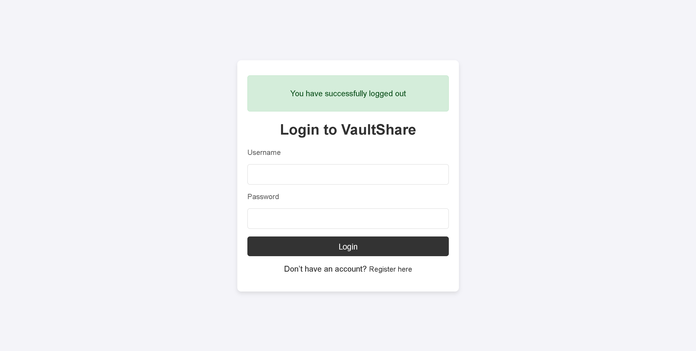
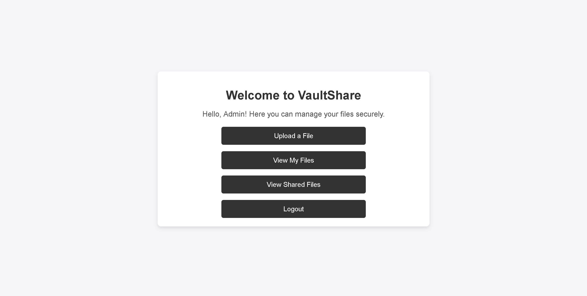
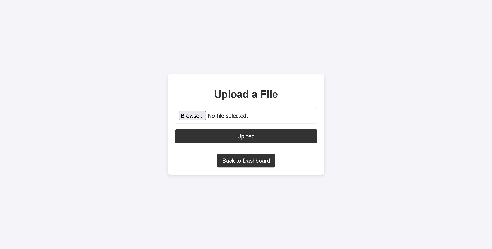
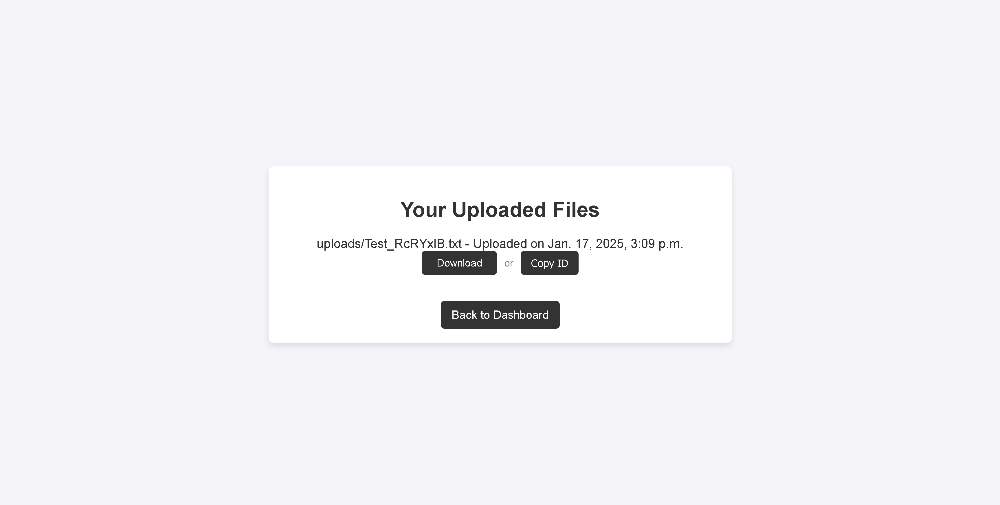
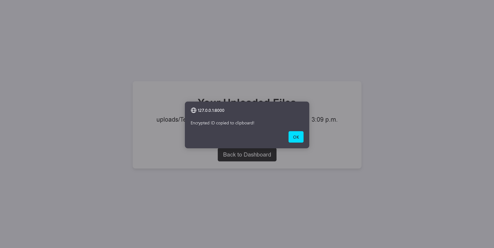
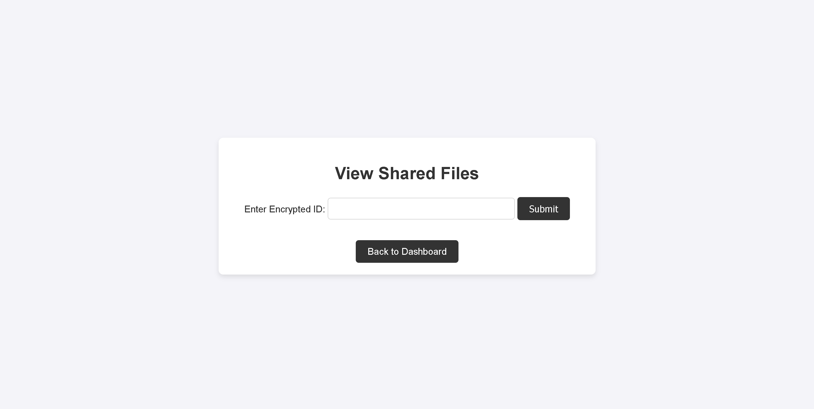
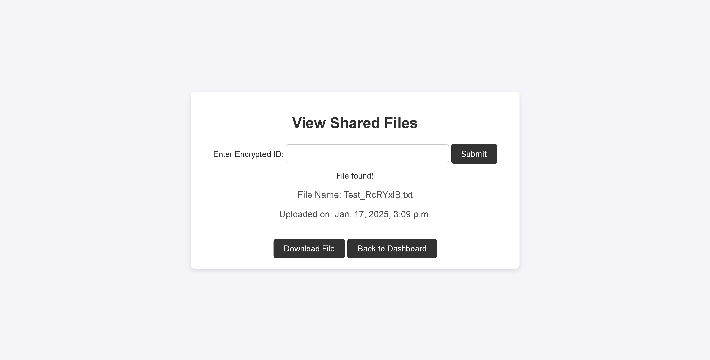

# 🔒 VaultShare

**VaultShare** is a secure file-sharing application built with Django. It allows users to upload encrypted files, manage access permissions, and track file usage.

## 🚀 Features

- **🔐 Secure File Uploads** – All files are encrypted before storage.
- **👤 User Authentication** – Only registered users can upload and access files.
- **📊 Real-Time Access Tracking** – Monitor who accessed your files and when.
- **⚡ Lightweight & Fast** – Built with Django and SQLite.

## 🛠️ Technologies Used

- **Backend:** Django (Python)
- **Database:** SQLite
- **Security:** Django Authentication, Encrypted File Storage

- ## 📸 Screenshots

## VaultShare

A secure file-sharing application built with Django, featuring user authentication and encrypted file uploads.

### **Screenshots**

#### **Login Page**


#### **Home Page**


#### **Upload a File**


#### **Your Uploaded Files**


#### **Copy File ID**


#### **Shared Files**


#### **Use a File ID**



## 📥 Installation Guide

### **1️⃣ Clone the Repository**
```sh
git clone https://github.com/YourUsername/VaultShare.git
cd VaultShare
